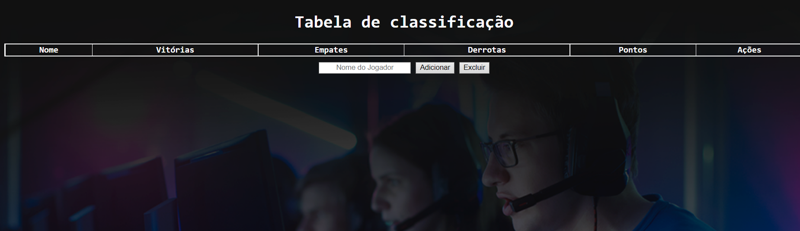

# Tabela de Classificação

[🔗 Clique aqui para acessar!](https://biogmmorais.github.io/TabelaDeClassicacao/)

> Imersão Dev - Alura

Nesse projeto utilizei javascript para gerar uma tabela de classificação, onde podemos adicionar jogadores, vitórias, empates ou derrotas, além de poder zerar a pontuação de cada jogador e/ou excluí-lo.

## 🛠 Tecnologias

- Javascript
- HTML
- CSS

## 📨 Contato

guilhermemm97@gmail.com